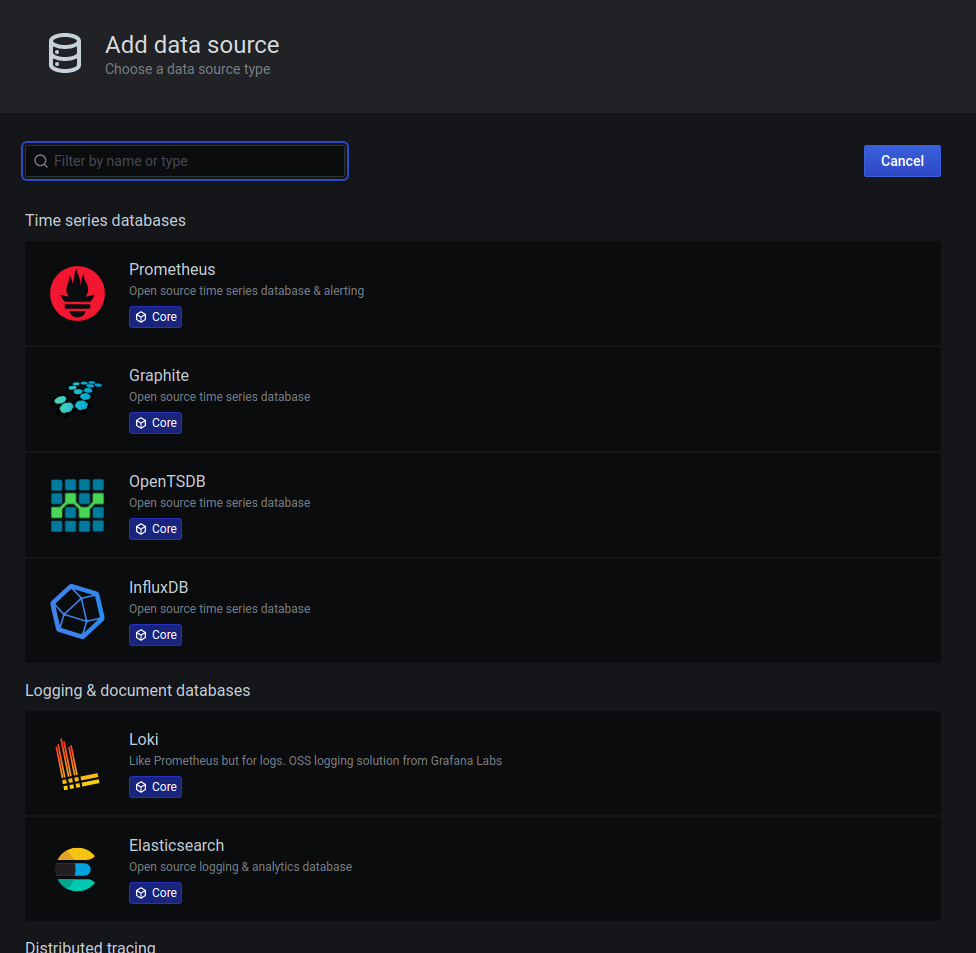

# Demo Kit
[](https://app.fossa.io/projects/git%2Bgithub.com%2Fbalchua%2Fdemo?ref=badge_shield)


This project is a simple demonstration of microservices using Springboot integrated with Zipkin.
It is a simple project that lists quotes from Marvel movies and users can vote which one of them they like.

The application then tally the votes.

The demo also presents better observability with Prometheus, Grafana, Loki and Sentry

## Prerequisites:

1. Kubernetes cluster (ex. [microk8s](https://microk8s.io/) ) 
2. Docker
3. [Skaffold](https://skaffold.dev/) version 1.17.1
4. [Helm](https://helm.sh/), version 3
4. [Maven](https://maven.apache.org/)
5. [jib-maven-plugin](https://github.com/GoogleContainerTools/jib/tree/master/jib-maven-plugin)
6. Observability tools - Prometheus, Grafana, Loki and Sentry

## Install Infrastructure

### Install MicroK8s

Install MicroK8s to easily bootstrap a Kubernetes cluster.  For simplicity we will use a single node MicroK8s.

```shell script
$ sudo snap install microk8s --channel 1.19/stable
$ microk8s config > $HOME/.kube/config #Export the kubeconfig to the default location
```

### Install kubectl

```
$ sudo snap install kubectl --classic
```

### Create your application namespace

We will be installing your application to `my-projecct` namespace.

```
$ kubectl create ns my-project
```

### Enable Prometheus addon

```shell script
$ microk8s enable prometheus
```

### Install Loki

```
$ helm repo add loki https://grafana.github.io/loki/charts # Add Grafana helm chart repo
$ helm upgrade --install loki --namespace=monitoring loki/loki-stack # Install the loki stack (loki and promtail) to monitoring namespace
```

Add `Loki` datasource, go to `Settings`.  Follow the screenshots below.


Select the Loki data.


Make sure that you set the http url to `http://loki:3100`


After that click ***Save and Test***

### Sign up to Sentry

#### What is Sentry

*Sentry is a service that helps you monitor and fix crashes in realtime. The server is in Python, but it contains a full API for sending events from any language, in any application.*

You can sign up for free [here](https://sentry.io/welcome/)

The java source codes already comes with Sentry Java SDK.

Sample screenshot from the application.


### Zipkin

To start Zipkin

`skaffold run -p local`

To stop Zipkin

`skaffold delete -p local`

Checkout the [`skaffold.yaml`](zipkin/skaffold.yaml).

In order to access zipkin, you can use `port-forwarding`

```
$ kubectl -n my-project port-forward svc/zipkin 9411:9411
```

You can now use your browser and point to `http://localhost:9411` to access zipkin

Sample screenshot


## Project structure
  
Main components are:
* `frontend/` - Hosts the web pages as well as RESTful access to backend services.
* `quotes/` - This component retrieves the Marvel character quotes data stored PostgresSQL.
* `votes/` - This component keeps track of the votes on each quote.
* `bot/` - The bot will randomly vote quotes to simmulate traffic into the kit.
* `bot-go/` - Golang version of bot.
* `protos/` - Keeps all `proto` files in one location.  
* `db/` - Contains all infrastructure related components such as PostgreSQL, Redis and flyway (to perform schema migrate).
   * `db/postgres` - Postgres kubernetes manifests.
   * `db/redis` - Redis kubernetes manifests.
   * `db/schema-migrate/` - Flyway schema migration manifests.  Run as Kubernetes `Job`.

* `zipkin/` - Stashes all Zipkin kubernetes manifests.


## Frontend

This is a springboot application that has a simple GUI, which calls the quote service to retrieve all the quotes, calls `vote` service to cast and tally votes.
The frontend exposed these REST endpoints.
* `/api/quote/list`
* `/api/vote/castVote`
* `/api/vote/tally`

UI style is brought to you by [Material Kit](https://demos.creative-tim.com/material-kit/index.html)

#### Build
Go to the directory `frontend/`

To build the project, do a `mvn clean install jib:dockerBuild`
For simplicity, you can also use the provided `skaffold.yaml` and run `skaffold run -p local` or `skaffold dev -p local` if you want continuous build and deploy to you local cluster.


#### Test
You can use Postman to test the frontend's RESTFul endpoints.

## Quote

This is another springboot application that retrieves quotes stored in PostgreSQL.
It uses [gRPC java](https://grpc.io/docs/tutorials/basic/java/) for communication.

Stacks:

* Springboot - 2.3.4.RELEASE
* [Lognet grpc-springboot-starter](https://github.com/LogNet/grpc-spring-boot-starter)

#### Build
Go to directory `quotes`

To build the project, do a `mvn clean install jib:dockerBuild`

#### Run

In order to run the `quotes` service, you need to have the *Quotes DB* up and running.

Use skaffold:
1.  Start the quotes DB (postgres)

`skaffold run -p quotes-db-local`

2.  Start the quotes service

`skaffold run -p local`

Checkout the [`skaffold.yaml`](quotes/skaffold.yaml).


#### Test
You can use [grpcurl](https://github.com/fullstorydev/grpcurl) to test it from command line.

#### Using `grpcurl`

To get all quotes

`grpcurl -plaintext localhost:50052 org.bal.vote.proto.internal.QuoteManagement/AllQuotes`

To get quote by Id:

`grpcurl -plaintext -d '{"quoteId":"0"}' localhost:50052 org.bal.vote.proto.internal.QuoteManagement/GetQuoteById`

## Vote

This is another springboot application that allows users to cast their favorite Marvel quotes.
It also tallies all the votes.

It uses [gRPC java](https://grpc.io/docs/tutorials/basic/java/) for communication.

It stores its data in Redis.

Stacks:

* Springboot - 2.3.4.RELEASE
* [Lognet grpc-springboot-starter](https://github.com/LogNet/grpc-spring-boot-starter)
* Redis

#### Build
To build the project, do a `mvn clean install jib:dockerBuild`
For simplicity, you can also use the provided `skaffold.yaml` and run `skaffold run -p local` or `skaffold dev -p local` if you want continuous build and deploy to you local cluster.


#### Run

In order to run the `votes` service, you need to have the *Quotes DB* up and running.

Use skaffold:
1.  Start the Votes DB (Redis)

`skaffold run -p votes-db-local`

2.  Start the vote service

`skaffold run -p local`

Checkout the [`skaffold.yaml`](votes/skaffold.yaml).


#### Test
You can use [grpcurl](https://github.com/fullstorydev/grpcurl) to test it from command line.

#### Using `grpcurl`

To get the votes tally

`grpcurl -plaintext  localhost:50052 org.bal.vote.proto.internal.VoteManagement/GetAllVotes`

To cast a vote:

`grpcurl -plaintext -d '{"quoteId":"0"}' localhost:50052 org.bal.vote.proto.internal.VoteManagement/CastVote`


## bot-go
The build uses a Dockerfile. Hence, docker daemon setup is required. 


## License
[](https://app.fossa.io/projects/git%2Bgithub.com%2Fbalchua%2Fdemo?ref=badge_large)
